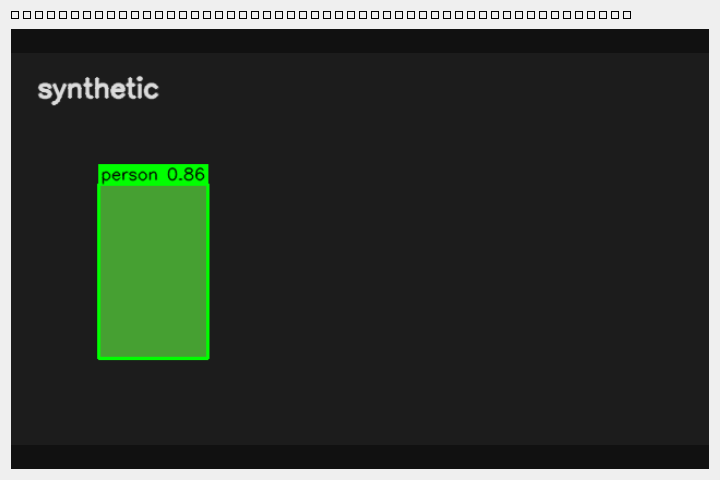
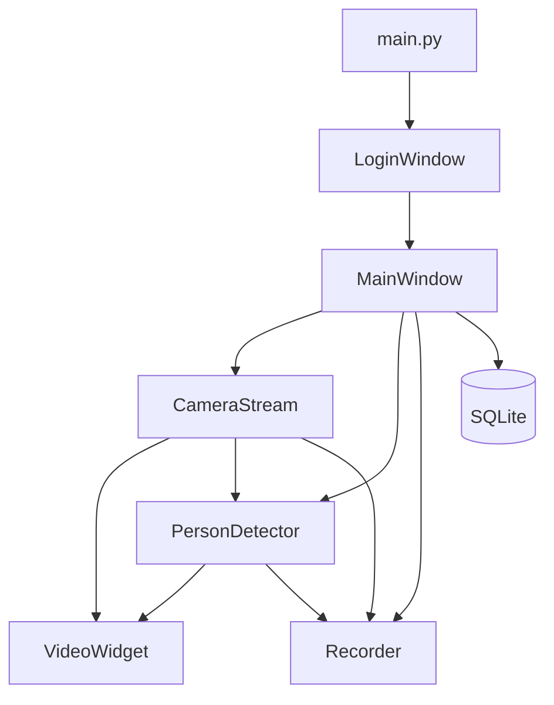

# SecureWatch

SecureWatch нужна, чтобы смотреть свою камеру на одном компьютере, замечать человека в кадре и сохранять ролик, не отправляя видео в облако.

Программа читает локальную камеру, свой RTSP или готовый ролик, рисует рамки людей и других сущностей и пишет MP4 вручную или пока человек в зоне. Записи лежат на диске и чистятся по сроку или по объёму. Пользователи с разными правами входят через окно входа.

Интерфейс на PyQt6. Кадры читает отдельный поток, детекция и запись тоже не блокируют окно. Пользователи и журнал событий лежат в SQLite.



На снимке нет записи с реальной камеры: это кадр, который рисует режим `synthetic`.

## Этот релиз

До четырёх своих источников в сетке 2×2. Детектор, зона и запись работают на выбранной ячейке. Окно остаётся открытым, если камера не ответила или модель YOLO не загрузилась.

- Вход с блокировкой после нескольких неверных паролей. Пароль первого запуска нужно сменить до открытия главного окна. Закрытие окна входа завершает программу.
- Роли: `viewer` только смотрит, `operator` и `admin` меняют источник, порог, снимок и запись, `admin` ещё создаёт пользователей кнопкой «Пользователь».
- Источник: индекс USB-камеры, RTSP, HTTP, видеофайл или `synthetic`. Выбранные источник и порог сохраняются в SQLite и поднимаются при следующем входе.
- На Windows камера открывается через Media Foundation, затем DirectShow. На Linux — V4L2. Если устройство пропало, поток переподключается ограниченное число раз. Пока кадра нет, кнопки записи выключены.
- Детекция людей (зелёная рамка «человек») и сущностей: транспорт и животные, оранжевая рамка «сущность». Звук и автозапись только на человека. Кнопка «Зона» ограничивает это прямоугольником на выбранной ячейке.
- При запуске открывается одна камера. Кнопка «Сетка» показывает 2×2, «Одна камера» возвращает выбранную ячейку на весь экран.
- Запись MP4 вручную и автоматически. Двойной щелчок по файлу проигрывает его на выбранной ячейке, «Пауза» и «К камере» возвращают живой поток. Клик по файлу показывает путь. Снимок и журнал событий остаются. Кадры в базу не пишутся.
- «Хранить, дней» удаляет ролики старше срока. «Объём, ГБ» после этого стирает самые старые, пока папка не уложится в лимит. 0 в любом поле отключает это правило. Проверка идёт при запуске и после каждой записи. Последний ролик из-за объёма не удаляется. Появление человека даёт короткий звук и красную строку «ЧЕЛОВЕК».

В этот релиз не входят размытие лиц, распознавание номеров, уведомления в мессенджер и веб-интерфейс.

## Пользователи

Второго пользователя создаёт администратор в главном окне. Зрителю достаточно учётки с ролью `viewer`: запись и настройки источника ему недоступны.

## Схема



## Запуск

Нужен Python 3.11+.

```bash
python -m venv .venv
.venv\Scripts\activate
pip install -r requirements.txt
python main.py
```

На Linux и macOS виртуальное окружение активируется через `source .venv/bin/activate`.

Первый запуск создаёт администратора:

- логин: `admin`
- пароль: `admin12345`

Пароль есть в коде только как значение первого входа. В лог он не пишется. Пока он не сменён, главное окно не откроется. Не публикуйте свою базу, логи и записи.

Модель `yolov8n.pt` при первом включении детектора скачивает Ultralytics в `assets/models/`. Для этого нужен интернет. Файл весов в git не входит.

## Источник видео

В поле «Источник» можно указать:

| Значение | Что это |
| --- | --- |
| `0` | Первая локальная камера |
| `rtsp://...` или `http://...` | Сетевой поток |
| путь к `.mp4`, `.avi`, `.mkv`, `.mov` | Файл, по окончании воспроизведение начинается сначала |
| `synthetic` | Кадры без камеры и без файла |
| `simulator` или кнопка «Нет камеры» | Крутит `assets/demo/demo.mp4`. Файл создаётся сам, если его ещё нет |

Демо-ролик без людей:

```bash
python scripts/make_demo_clip.py
```

В источнике укажите `assets/demo/demo.mp4`.

Те же параметры можно задать до запуска, см. [`.env.example`](.env.example): `SECUREWATCH_CAMERA_SOURCE`, `SECUREWATCH_CONFIDENCE`, `SECUREWATCH_INFERENCE_INTERVAL`.

## Тесты

Тесты не открывают камеру и не скачивают YOLO.

```bash
pip install pytest pytest-qt
pytest
```

`pytest` и `pytest-qt` уже перечислены в `requirements.txt`.

## Что не попадает в git

- `data/securewatch.db` — пользователи, журнал и сохранённые источник с порогом
- `data/recordings/` и `data/snapshots/` — видео и снимки
- `logs/` — файлы лога
- `.env` — локальные адреса камер
- веса `*.pt`

Для демонстрации показывайте `synthetic` или `assets/demo/demo.mp4`, а не архив с реальной камеры.
